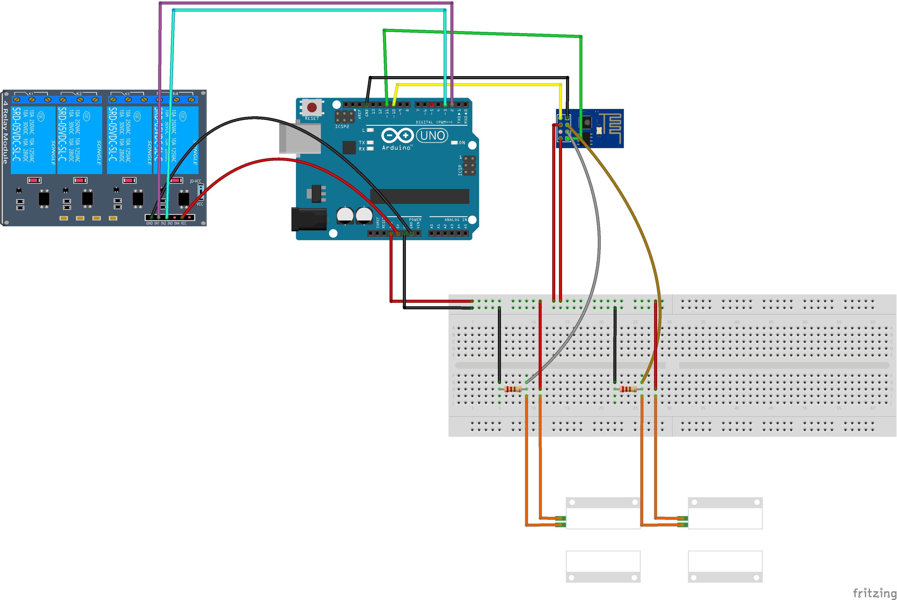

# garage-doors-opener
An application to open my garage doors with an arduino system through internet.

**Materials you will need for two doors** 
* 1 Arduino Uno *10€*
* 1 ESP8266-01 *5€*
* Some jumber wire *6€ for 140*
* 2 220 resistor *5€ for 10*
* 2 Magnetic switch *8€ for 5*
* 1 4 Channel Module Relay *6€*
Total: **37€**

To reproduce my system you need to know how to upload code to the ESP8266 and to the Arduino Uno.

If you are able to code, you don't have to use an Arduino Uno, you only need to use an ESP8266-12.

To use the application you have to use URLs like where `oGXabhvW6k` is the password and `1` the number:
* `/garage/1/toggle/oGXabhvW6k` to toggle a door
* `/garage/1/status/oGXabhvW6k` to get the status of the door